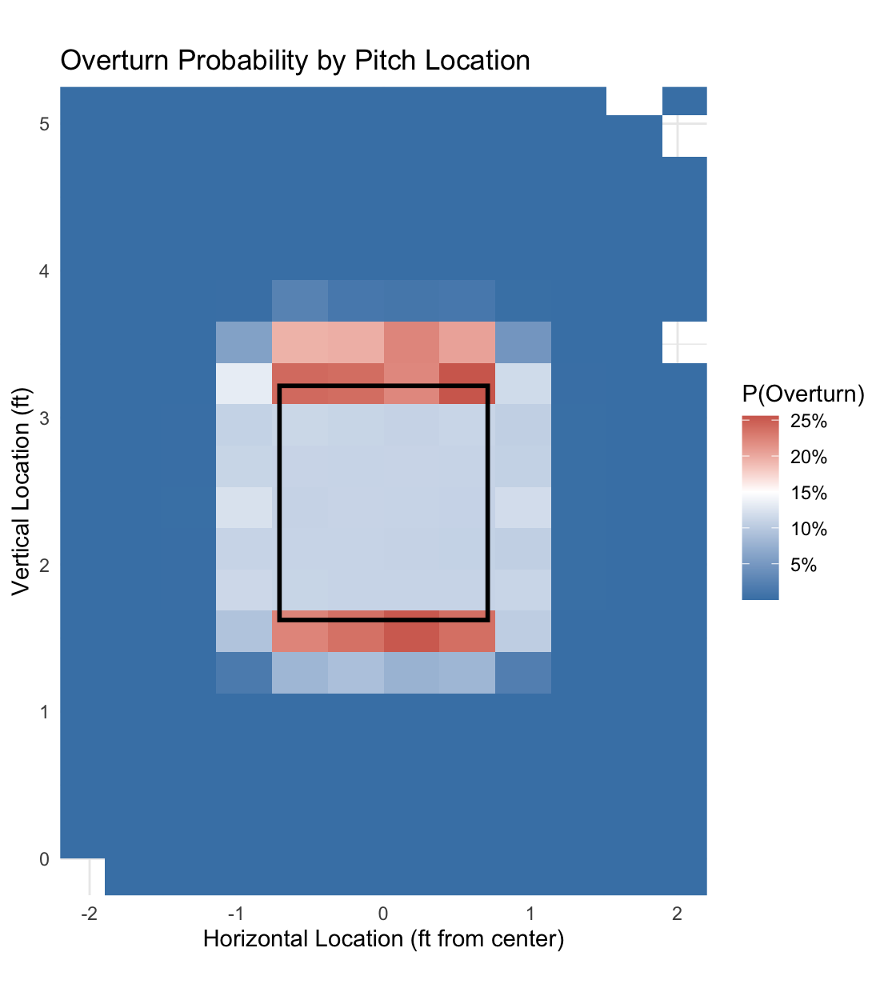
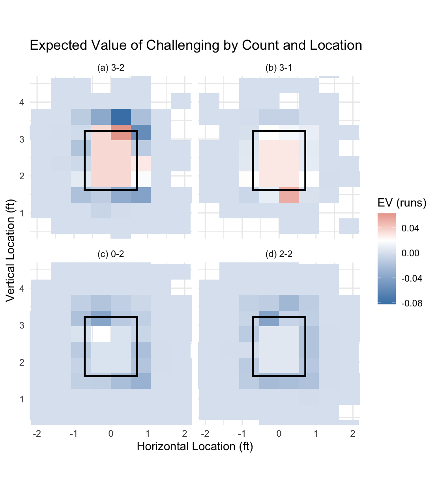

# MLB ABS Challenge Research

A logistic regression model that tells you whether an MLB Automated Ball-Strike challenge is worth using — trained on 2026-season Statcast data, validated for the exact multicollinearity and linearity assumptions a real model needs to satisfy.

MLB's new ABS challenge system lets teams challenge umpire calls a limited number of times per game. This project answers: **when is a challenge actually worth using, and when should a team save it?**

## What It Does

- Pulls every called pitch (no swings, no balls in play) from the 2026 season via Statcast, since only called pitches are eligible for an ABS challenge
- Engineers the actual ABS strike zone geometry — 17" wide plus ball radius, batter-specific vertical bounds — and labels each umpire call correct or incorrect against it
- Joins every pitch to Tango's run-expectancy matrix twice: once for the actual count, once for the count that would result if the call were overturned, to get the run value of a successful challenge
- Fits a logistic regression predicting overturn probability from pitch location and count, with full assumption diagnostics (linearity in the log-odds, VIF for multicollinearity, Cook's distance for influential points)
- Computes `EV = P(overturn) × run_expectancy_delta` per pitch and applies a decision rule — challenge now if EV beats the opportunity cost of saving the challenge for later, where that opportunity cost declines as the game goes on
- Visualizes both overturn probability and expected value across the strike zone and by count

## Key Result

Expected value is highest for borderline pitches in high-leverage counts. A borderline call in a full count (3-2) carries an expected value above **+0.06 runs** if challenged — the single highest-value challenge situation identified in the data.

## Overturn Probability by Pitch Location

Predicted probability that an umpire's call gets overturned, by where the pitch crossed the plate. Risk is highest right at the edge of the strike zone, where the human eye is least reliable.



## Expected Value by Count and Location

Expected run value of challenging, broken out by the four highest-leverage counts. The 3-2 count carries the largest swing, since a successful challenge there can turn a strikeout into a walk (or vice versa).



## Quick Start

```bash
git clone https://github.com/BenjaminTell007/mlb-abs-challenge-research.git
cd mlb-abs-challenge-research
```

In R:
```r
install.packages(c("baseballr", "dplyr", "car", "broom", "ggplot2", "scales"))
source("abs.R")
```

The raw Statcast pull is already cached at `data/raw/called_pitches_2026.csv`, so `abs.R` runs end to end — feature engineering, model fit, diagnostics, and figure generation — without needing a fresh Statcast query.

Full write-up, model diagnostics, and citations: **[docs/METHODOLOGY.md](docs/METHODOLOGY.md)**

## Tech Stack

| Tool | Why |
|---|---|
| `baseballr` | The standard R interface to Statcast — pulls pitch-level location and outcome data directly, no manual scraping |
| `dplyr` | Feature engineering: zone-boundary joins, count-state joins against the run-expectancy table |
| Logistic regression (`glm`) | The target is binary (overturned or not) and the question is a well-calibrated *probability*, not just a classification — logistic regression gives that directly, and its coefficients are directly interpretable (distance from zone edge → change in overturn odds) |
| `car`, `broom` | Assumption diagnostics — VIF for multicollinearity, tidy model summaries |
| `ggplot2`, `scales` | Publication-quality figures for the overturn-probability heatmap and EV-by-count plots |

## Challenges Overcome

- **Multicollinearity in the zone-distance features.** An initial combined "distance from zone edge" term produced a VIF over 100. Rather than ignore it, the feature was split into separate horizontal/above-zone/below-zone distance terms, bringing VIF under 1.2 — documented in the methodology writeup along with the diagnostic that caught it.
- **Run expectancy for a hypothetical, not just the actual outcome.** Computing the *value* of a challenge (not just its probability of succeeding) required joining each pitch to two different run-expectancy states — the actual count and the count that would result from a flipped call — and handling walks/strikeouts as terminal states rather than count transitions.

## Future Improvements

- Replace the fixed `save_value` schedule (0.05 / 0.03 / 0.01 by inning) with an estimate of the actual expected value of saving a challenge for a future opportunity, rather than a hand-set decay schedule
- Extend past the March 26 – May 18 sample to a full season once more 2026 data is available, to check whether the overturn-probability surface is stable across months
- Validate the model's predicted overturn probabilities against actual ABS challenge outcomes as real challenge data accumulates

## Repository Contents

- `abs.R` — full pipeline: data pull, feature engineering, run expectancy, model fitting, assumption checks, decision rule, visualizations
- `data/raw/called_pitches_2026.csv` — cached Statcast pull (called pitches only)
- `data/processed/df_final.rds` — engineered feature set
- `outputs/model_logit.rds` — fitted logistic regression model
- `figures/` — final plots
- `docs/METHODOLOGY.md` — detailed methodology, model diagnostics, and references
